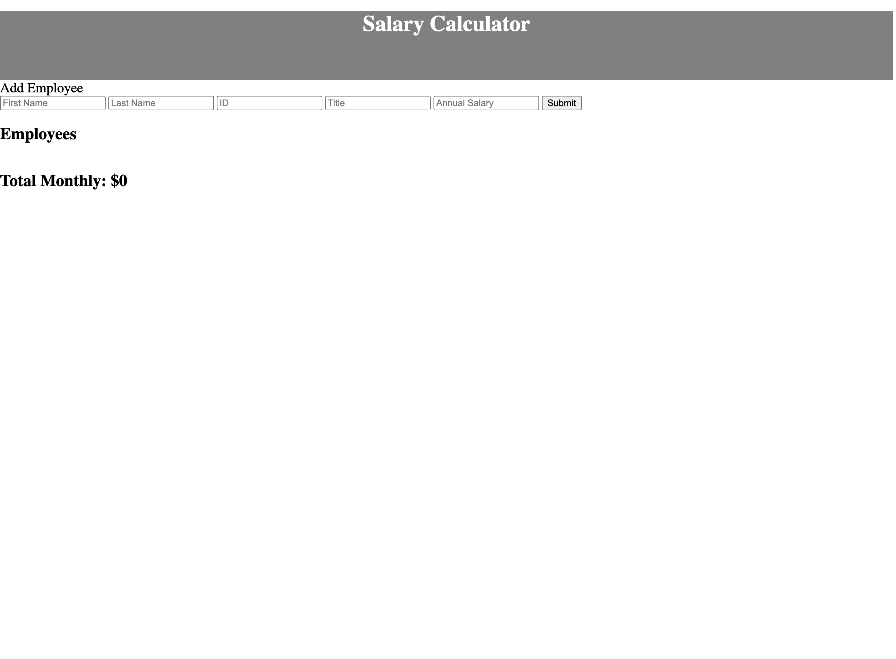
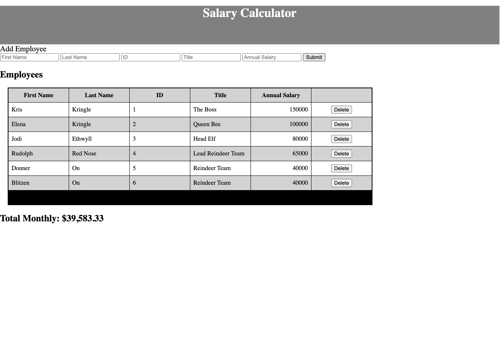

# jQuery Salary Calculator

## Description

_Duration: Weekend 12 hours_

This application allows a user to create a data object containing identifiers for employees (First Name, Last Name, ID, & Title) and their annual salary. The application displays the entered data as a table. Below the table, the application shows the total monthly expenditure on salary per month for the employees entered into the application. Entries may also be deleted by the user which will remove that entry and recalculate the toal monthly salary expenditure without the deleted entry.  

While these procedures could be executed strictly as outputs, this application explicitly writes and deletes entries to the data level. There is a data object with all of the entered information the user inputs and/or deletes from it. This makes it possible to expand the functionality of this application in the future to allow for the possibility of allowing the user to export the data to a file or to modify the table into an interactive spreadsheet in future versions.  

To see the fully functional site, please visit: [the herokuapp deployment](https://vast-beach-59962.herokuapp.com/)

## Screen Shots

Initial state of the application

The application in action

## Installation

Open index.html in the browesr. 

## Built With

- html
- css
- javascript
- jquery

## License
[MIT](https://choosealicense.com/licenses/mit/)

## Acknowledgement
Thanks to [Prime Digital Academy](www.primeacademy.io) who equipped and helped me to make this application a reality. (Thank your people)

Special thanks to my learnign group for this week from my Vatti Cohort:
- [Zuber Abdikadir](https://github.com/zuberabdikadir)
- [Joelle Kado](https://www.linkedin.com/in/joellekado/)
- [Jordan Newberry](https://github.com/jordanNewberry21)

## Support
If you have suggestions or issues, please email me at [steven.maloney@gmail.com](mailto:steven.maloney@gmail.com)